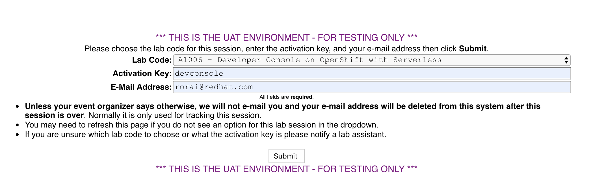

# Accessing to the Lab Environment

## Getting your dedicated lab environments using Guid Grabber

On your laptop, you **MUST** open a browser tab with [*Lab GUID Assignment page*](https://www.opentlc.com/gg/gg.cgi?profile=generic_tester) before continuing with the lab instructions:

* From this page, you will be assigned your unique GUID, which you will use to access your unique lab environment and systems.

> **NOTE: You are not required to login anywhere at this point, in this intro lab you will only get the information related to your assigned lab environments.**

### Getting Cluster Environment - **Browser Tab**

This will be your lab environment where all of the work will be done. 

From the drop down list:

1. Choose the lab `A1006 - Developer Console on OpenShift with Serverless`
2. Enter the activation key shared by the instructors
3. Enter your email address
4. Click submit
5. Save the information on screen

e.g:

The resulting *Lab Information page* will display your lab's GUID and other useful information about your lab environment.
Take note of your assigned GUID.

You will use this GUID to access your lab's environment and systems.
Your unique GUID will also be embedded in your lab environment's host names.

## Lab Environment Overview
This lab environment is basically an OCP 4.1 cluster that has been upgraded to 4.2 using OTA update mechannism of Openshift. We will be working mostly through the UI of Openshift Console using the Developer perspective.

## Prerequisites 
Basic knowledge of Openshift is required for this lab. Also, some knowledge of Knative and Tekton Pipelines would be beneficial but not required.

Next Lab: [1 - Login into OpenShift Console](./login.md) 
[Home](./README.md)
